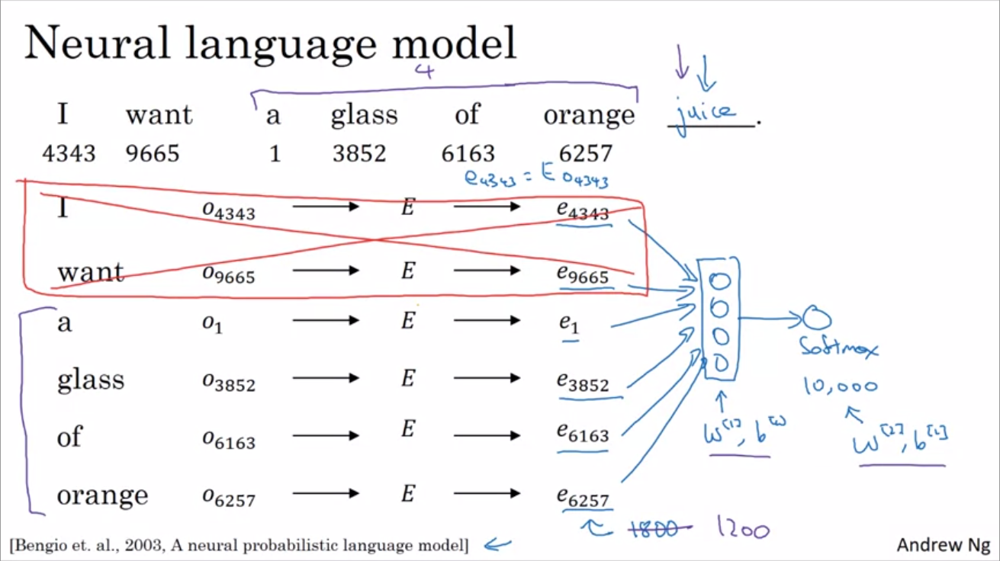

# 问答摘要与推理

Question and Answer summary and reasoning

该项目来源于百度AI-Studio比赛项目，点[这里](https://aistudio.baidu.com/aistudio/competition/detail/3)可以查看详细信息.

完成项目的主要步骤：

- 处理原始数据集
  将原始数据集进行清洗整理成我们方便使用的数据集，同时保存到文件中，以备下次使用。

- 训练词向量
  根据处理后的数据集训练得到词向量模型。

  - 余弦相似度
    word embedding相比于one hot可以更好的表示每个词，同时，使用word embedding表示的词可以很好的来量化词与词之间的相似度，这对于NLP来说是非常重要的。词之间的相似度的计算公式如下所示：

  $$
  similarity(u,v) = \frac{u^Tv}{\|{u}\|_{2} \|{v}\|_{2}}
  $$
  ​		该相似度被称为余弦相似度，因为上述公式求的就是$u$和$v$两个向量之间的夹角。

  - Neural language model

      关于如何训练词向量，最开始常用的是Neural language model，首先我们设定一个固定的word Embedding向量E，其维度为（vocabulary_size, word_embedding_dimension）,设定取词窗口w，然后在每句话都按照顺序将每个取词窗口中的词（context）用词向量表示，放入神经网络模型中，其输出结果是该取词窗口的下一个词（target word）。说的可能不清楚，可以看Andrew Ng讲述的图：

      

      另外，context和target word可以有不同的选择，比如：target word的后四个词、target word的前后4个词、后一个词、前一个词、甚至整个句子。训练出来的word embedding模型都会有不同的意义。

  - Word2Vec

      Word2Vec模型相比于Neural language model是一种更简单高效的训练word Embedding model的方法。Word2Vec模型主要有两种形式：Skip-grams和CBow。

      - Skip-grams

          Skip-grams选择context和target word的方式不同于Neural language model，它是先选择一个context word，然后固定一个取词窗口（比如size=10），那么就在这10个词中随机选择target word，组成好几组【context word, target word】的组合进行上述的训练。当然，建立这样的监督学习任务是为了得到更好用的word embedding模型。

          使用这样的Skip-grams仍然存在很多的问题，最主要的是速度问题。

          - 速度问题
              如果用$o_c$表示词对应vocabulary的one-hot表达式，E表示word embedding模型，则$e_c=E o_c$表示该词对应的word embedding表达式，那么Skip-grams模型的softmax部分可以用下述公式表示：
              $$
              P(t|c) = \frac{e^{\theta_t^T e_c}}{\sum_{j=1}^{VocabSize}e^{\theta_j^T e_c}}
              $$
              其中$c$是context，$t$是target word，$\theta_t$是$e_c$对应的的参数。通常VocabSize都会非常的大，少则几万，多则几百万，几亿，那么这个softmax的分母的求和运算速度就会变得非常的慢。因此，有几种解决方案可以缓解该问题，其中一种是**Hierarchical softmax**。它是将整个vocabulary用许许多多的二元分类器拆分成了多个子集，这样在寻找分类的时候就不用从vocab_size个类中找出那一个类，最终只需要一个二元分类器就可以找到我们需要的类。

              当前的模型有一个非常严重的问题，就是计算softmax的成本非常大。

          -  Negative sampling

              这个算法要做的事情就是，在一个句子中，我们选择固定的一个词作为context，然后在选定的选词窗口（比如前后10个词）中选择一个词作为target word，然后将该\<context, target word\>当作一个整体作为输入，然后标记为1，作为我们的positive sample。另外，再从vocabulary中随机选择k个词作为其他几组target word，然后标记为0，作为我们的negative samples。然后在训练词向量的时候，我们在做softmax运算的时候，就不用像Skip-grams每次都计算vocab个分类，只需要计算（k+1）个二元分类器即可。大大减少了计算量。

              | context | word  | target |
              | ------- | ----- | ------ |
              | orange  | juice | 1      |
              | orange  | king  | 0      |
              | orange  | book  | 0      |
              | orange  | the   | 0      |
              | orange  | of    | 0      |

              这个算法中有一个很重要的细节是如何选择negative samples，因为如果按照经验概率分布来选择的话，可能会选择很多“的”、“了”、“这”等词，但是如果根据平均概率分布来选择的话，就不能够很好的体现英语中单词的分布，原文作者的建议是根据经验，最好的办法是采用启发式的值，也就是介于经验概率分布和平均概率分布之间，作者们给出了下面的选择公式：
              $$
              P(w_i) = \frac{ f(w_i)^{ \frac{3}{4} } } {\sum_{j=1}^{vocabSize}{f(w_j)^{\frac{3}{4}}}}
              $$
              其中$w_i$表示所选取的负采样的词。

      - CBow
          CBow与Skip-grams不同的是它是固定target word，然后从target word前后选取context来训练word embedding。

  - GloVe
      Glove算法由于其简洁性，也拥有很多的拥簇着，模型公式如下所示：
      $$
      min(\sum_{i=1}^{vocabSize} \sum_{j=1}^{vocabSize} f(x_{ij}) (\theta^T e_j + b_i + b_j' - logX_{ij})^2)
      $$
      其中，$X_{ij}$表示词$i$在词$j$的上下文出现的次数，用于表示两者相似的程度。$f(x_{ij})$为权重系数，当词$i$和词$j$为类似于“的”“了”“这”的词的时候，减小权重，不至于这些词占用太多的比重，对于其他比较重要但是在vocabulary中出现的次数太少，我们可以通过$f(x_{ij})$来增加权重增加这类词的比重。

  在实际项目中，已经有较为成熟的python软件包gensim来实现词向量的训练，其中包括许多模型，比如Word2Vec、FastText等。

  训练完的模型也可保存为文件，以备下次使用，这样以后就不用每次要使用的时候都训练一次。

- 构建seq2seq模型
  根据训练完的word embedding模型构建Seq2Seq模型，主要的结构就是encoder和decoder结构，这是该项目的baseline模型。构建完后即可进行初步的训练。

- 确定如何输出概率最大的句子（pick the most likely sentence）
  一般有两种算法选择：greedy search or beam search

  - greedy search（贪婪搜索）
      在seq2seq模型的decoder结构中，每次选择单词都是从list中选择当前概率最大的一个单词，而不是试着找到最有可能的句子。另外，因为有些句子的长度比较长，比如有10个词，而词库里面有1万的备选词，那么一个句子的选择空间则有$10000^{10}$个，计算量非常大，所以有时候又会使用近似搜索的算法来解决这个问题，以尝试找到概率最大的句子

  - beam search
      beam search不同于greedy search的是，beam search在每一个step中不是选择概率最大的词，而是设定了一个集束宽度（例如B=3），然后在每个step中选择B个概率最大的词，然后接下来针对选出来的B个词，再在下一个step中选择B个最大的词。另外next step的选择空间相比于greedy search就变成了B * 10000个。

      当所有的step进行完之后，最后需要从B个sentence中选择出概率最大的那个，但是在确定整个sentence的概率的时候，如果选择相乘每个单词的概率，即$P(y^1)P(y^2)...P(y^n)$作为整个sentence（$y^1y^2...y^n$）的概率的话，那么，由于每个单词的概率都小于1，所以：

      - 首先整个句子的概率会变得非常非常小（远小于1），对计算机来说，这种浮点型的存储精度太小了，所以一般这种情况可以在概率计算公式前面加上log运算，那么最后计算的整个句子的概率的log值就是所有单词的概率的log运算的总和，那么最后的得到是一个数值更稳定的算法。用公式表示即如下所示：
          $$
          argmax{\prod_{t=1}^{T_y}{P(y^{<t>}|x,y^{<1>},... y^{<t-1>})}} \\
                    \downarrow \\
                    argmax{\sum_{t=1}^{T_y}{logP(y^{t}|x,y^{<1>},... y^{t-1})}}
          $$

      - 第二点是系统会倾向于输出较短的句子，因为词语越少，整个句子的概率会越来越大（整个句子的概率是所有的词语的概率相乘，而所有单词的概率都是小于1的，如果进行了log运算，那么计算的值是小于0的，同样也是累加的越多，值越小），所以我们可以增加一种正则化的算法（length normalization）来缓解这种问题，即在前面加上一个系数$\frac{1}{T_y}$。但是在实践中作为一个启发，不是除以$T_y$，而是用一种更柔和的方法，即对$T_y$取$\alpha$的幂：
          $$
          \frac{1}{T_y^{\alpha}}\sum_{t=1}^{T_y}{logP(y^{t}|x,y^{<1>},... y^{t-1})}
          $$
          那么，$\alpha$则是另一个可手动调节的参数，$\alpha$取0则表示不使用正则化，$\alpha$取1则表示完全使用正则化，减小$\alpha$则表示减轻正则化的程度。

      **另外补充一点**：为什么选择使用beam search，而不使用其他搜索算法比如BFS或者DFS，因为BFS或者DFS都是用于找到确切的极值，但是beam search是尝试找到极值，但不是一定能找到。这就是他们的区别。

      使用了beam search之后，如果出现了问题，该如何定位到底是beam search的问题还是RNN的问题呢？由于我们的时间精力有限，我们需要集中时间把时间留给给更值得花时间的地方，我们可以通过下面的方法判断：比如对于该问答摘要与推理项目，我们可以比较数据集中人类给出的摘要的概率（y\*）和模型计算给出的摘要的概率（$\hat{y}$）（可以多对比一下开发集中的句子看看哪个更多），可得到以下两种结果：

      1. y\* > $\hat{y}$，但是beam search却选择了$\hat{y}$，这个时候beam search更值得去纠错；
      2. y\* < $\hat{y}$，但是实际上y\*相比与$\hat{y}$是更好的结果，而RNN模型却预测出$P(y^*|x)<P(\hat{y}|x)$，所以这个时候RNN模型更值得去纠错。

- 增加attention机制
  attention机制是对encoder-decoder模型的改进，这是深度学习领域最具影响力的思想之一。

  比如对于翻译任务，一般的encoder-decoder模型无法记住很短或者很长的句子，所以对一般encoder-decoder模型预测的结果进行评分的话，会发现随着句子的缩短或者随着句子的变长，对翻译评分（使用Bleu算法评分）都会降低。所以增加注意力模型，让模型在某个时间点只关注句子的一部分。这样的话，随着句子的变长，评分就不会降低，但是对于较短的句子，评分还是相对比较低的。

  attention模型最开始是用于翻译，但是现在也在其他应用中被广泛使用。

- baseline seq2seq模型中存在的问题：
    - 无法准确地再现文章的事实细节
    - 无法解决摘要中的未登录词（OOV）问题
    - 倾向于生成重复的摘要语句

- 优化baseline中出现的问题

  - 大量的重复词语的出现
    可以用Coverage算法优化该问题
  - 大量的OOV的出现（word embedding中没有的词）
    可以用pointer-generator network优化该问题，结合了抽取式和生成式的优点
- 测试模型
  用评估算法评估模型的好坏，传统方法是BLEU分数

